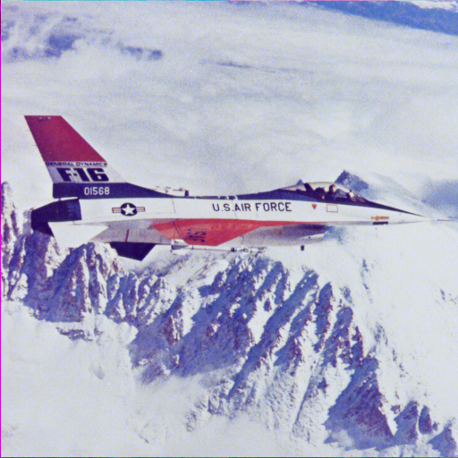
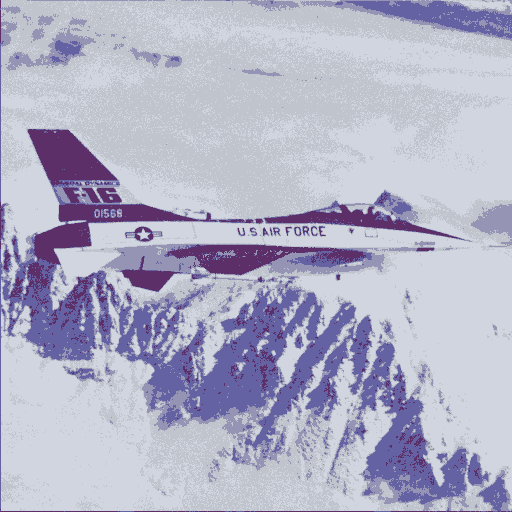
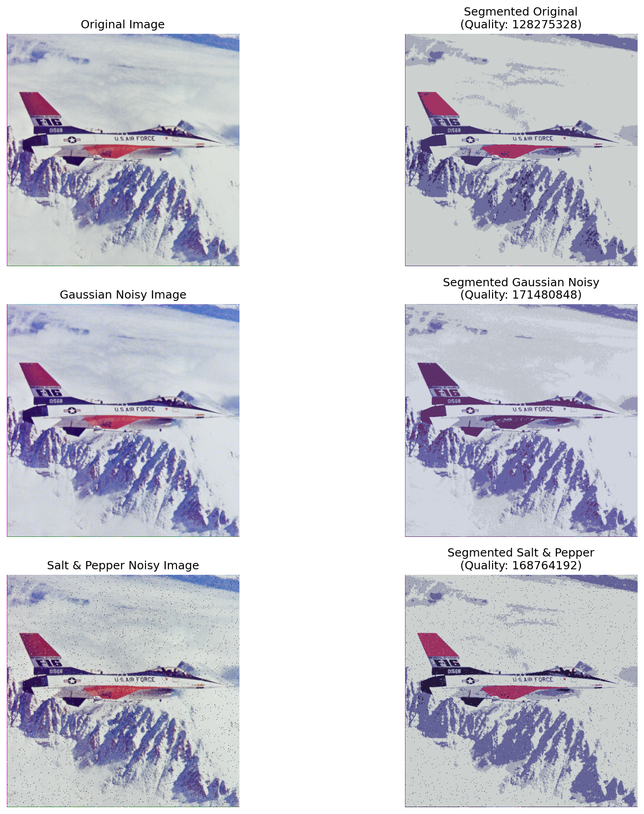

# CV Assignment 2
## Git
Repository: [https://github.com/joakiaam/CV-Assignment-2](https://github.com/joakiaam/CV-Assignment-2)
## Task 1: Apply noise and filter
### Original Image

### Noisy Image (Gaussian Noise)

### Denoised Image (Gaussian Filter)

### Noisy Image (Salt and Pepper Noise)

### Denoised Image (Median Filter)

### MSE/PSNR/SSIM Comparison
| Noise Type            | MSE   | PSNR (dB) | SSIM   |
|-----------------------|-------|-----------|--------|
| Gaussian Noise        | 96.24 | 28.3      | 0.8703 |
| Salt and Pepper Noise | 26.04 | 33.97     | 0.9557 |

## Task 2: Image Segmentation Analysis (Before and After Noise)

### Method
**K-means clustering** (k=5) was used to segment the original image and compare it with the same image after noise.

### Segmentation Results

#### Original Image Segmentation

#### Gaussian Noisy Image Segmentation

#### Salt & Pepper Noisy Image Segmentation

### Comparison Visualization

### Quantitative Analysis

Segmentation quality is measured using **Within-Cluster Sum of Squares (WCSS)** a lower value indicate more compact and homogeneous clusters:

| Image Type          | WCSS        | Degradation |
|---------------------|-------------|-------------|
| Original Image      | 128,275,328 | Baseline    |
| Gaussian Noisy      | 171,480,848 | +33.7%      |
| Salt & Pepper Noisy | 168,764,192 | +31.6%      |

### Key Findings

- Gaussian noise gives the biggest drop in segmentation quality (**+33.7% WCSS**).
- Salt & pepper noise also degrades clustering clearly (**+31.6% WCSS**).
- In both cases, noisy pixels are assigned to less accurate clusters, so regions become less clean.

### Discussion

- Noise changes pixel colors, and K-means depends directly on color distance, so segmentation gets worse.
- Gaussian noise affects nearly all pixels, so it harms clustering slightly more than salt & pepper here.
- A denoising step before segmentation gives more stable and cleaner regions.

### Conclusion
K-means segmentation quality drops for both noise types (about **32-34%** higher WCSS).
Having an image with noise leads to less accurate segmentation, 
so for better segmentation results, it is crucial to have an image with as little noise as possible.
